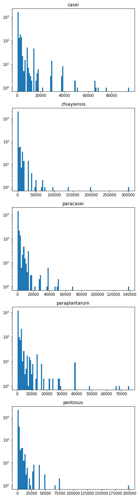
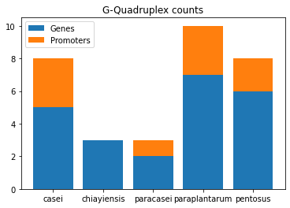

# Проект по Биоинформатике
## Google Colab с вычислениями
[https://colab.research.google.com/drive/1UXSbTtBYY6Ui5sE9tJp1IGGiNHW_sdNz?usp=sharing](https://colab.research.google.com/drive/1UXSbTtBYY6Ui5sE9tJp1IGGiNHW_sdNz?usp=sharing)

В данной работе производится анализ z-DNA таксона Firmicutes в родах Lacticaseibacillus, Lactiplantibacillus. \
Выбранные виды это
1. 	Lacticaseibacillus casei
2. 	Lacticaseibacillus paracasei
3. 	Lacticaseibacillus chiayiensis
4. 	Lactiplantibacillus pentosus
5. 	Lactiplantibacillus paraplantarum
## Распределение z-dna в геномах

## Статистика по геномам

| species |gene length |gene count |genome length |gene part |z-dna count |z-dna length |
| --- | --- | --- |--- |--- |--- |--- |
|casei|2486266|2810|2924929|0.850026|2254|24372
|chiayiensis|2360721|2630|2855405|0.826755|2187|23553
|paracasei|2460531|2870|2861969|0.859734|1949|21182
|pentosus|2890815|3219|3622107|0.798103|2677|29301
|paraplantarum|2580666|2954|3133857|0.823479|1711|18711

## Расположение z-dna в геноме

## Распределение кластеров по количеству попавших в них генов

## Статистика по выбранным кластерам
Среди всех кластеров были выбраны кластеры с наличием Z-DNA в промотере.
### Продукт генома
| Номер кластера | Продукт гена |
| --- | --- |
|737|phosphocarrier protein HPr|
|864|ABC transporter ATP-binding component|
|885|50S ribosomal protein L11|
|897|truncated oxidoreductase|
|942|50S ribosomal protein L18|
|952|50S ribosomal protein L22|
### Число z-dna в промотере
||casei|chiayiensis|paracasei|pentosus|paraplantarum
|---|---|---|---|---|---|
|737|1|1|2|1|1|
|864|2|2|2|1|1|
|885|1|1|1|1|1|
|897|2|1|1|1|1|
|942|2|2|2|2|2|
|952|1|1|1|1|1|

### Число z-dna в гене
||casei|chiayiensis|paracasei|pentosus|paraplantarum
|---|---|---|---|---|---|
|737|0|0|0|0|0|
|864|2|0|1|0|1|
|885|0|0|0|0|0|
|897|1|1|3|0|2|
|942|1|1|0|0|0|
|952|0|0|0|0|0|

### Макимальный z-score в промоутере
||casei|chiayiensis|paracasei|pentosus|paraplantarum
|---|---|---|---|---|---|
|737|1078.1930|1078.1930|1078.1930|766.6232|766.6232|
|864|13713.9900|13713.9900|13713.9900|1164.5200|1323.0540|
|885|540.6191|1051.5070|540.6191|830.5338|830.5338|
|897|2752.4470|650.9198|13713.9900|546.8554|883.5764|
|942|1733.5030|1733.5030|1733.5030|2541.4120|2541.4120|
|952|883.5764|883.5764|883.5764|731.2843|731.2843|
## Результат выравнивания белков
Файлы с выравниванием находятся в папке data с расширением afa.
## Расположение промотерных z-dna относительно генов (в порядке представленном выше)

# Бонус G-Quadruplex
## Ссылка на ноутбук
[https://colab.research.google.com/drive/1XPbbLXY1FzFw2MUD5M8j1aoeH2WPN8D6?usp=sharing](https://colab.research.google.com/drive/1XPbbLXY1FzFw2MUD5M8j1aoeH2WPN8D6?usp=sharing)

## Статистика по расположению G квадруплексов

## Промоутеры с наличием G квадруплексов
||casei|chiayiensis|paracasei|pentosus|paraplantarum
|---|---|---|---|---|---|
|31|0|0|0|0|1|
|65|0|0|0|0|1|
|73|0|0|1|0|0|
|433|1|0|0|0|0|
|569|1|0|0|0|0|

Как можно заметить у нас нет гомологичных промоутеров с G квадруплексами.