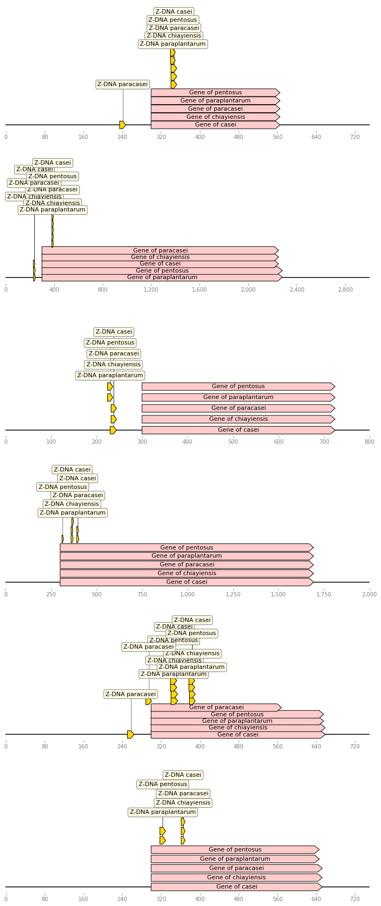

# Проект по Биоинформатике
## Google Colab с вычислениями
[https://colab.research.google.com/drive/1UXSbTtBYY6Ui5sE9tJp1IGGiNHW_sdNz?usp=sharing](https://colab.research.google.com/drive/1UXSbTtBYY6Ui5sE9tJp1IGGiNHW_sdNz?usp=sharing)

В данной работе производится анализ z-DNA таксона Firmicutes в родах Lacticaseibacillus, Lactiplantibacillus. \
Выбранные виды это
1. 	Lacticaseibacillus casei
2. 	Lacticaseibacillus paracasei
3. 	Lacticaseibacillus chiayiensis
4. 	Lactiplantibacillus pentosus
5. 	Lactiplantibacillus paraplantarum
## Статистика по геномам

| species |gene length |gene count |genome length |gene part |z-dna count |z-dna length |
| --- | --- | --- |--- |--- |--- |--- |
|casei|2486266|2810|2924929|0.850026|2254|24372
|chiayiensis|2360721|2630|2855405|0.826755|2187|23553
|paracasei|2460531|2870|2861969|0.859734|1949|21182
|pentosus|2890815|3219|3622107|0.798103|2677|29301
|paraplantarum|2580666|2954|3133857|0.823479|1711|18711

## Расположение z-dna в геноме

## Распределение кластеров по количеству попавших в них генов

## Статистика по выбранным кластерам
Среди всех кластеров были выбраны кластеры с наличием Z-DNA в промотере.
### Продукт генома
| Номер кластера | Продукт гена |
| --- | --- |
| 20|replicative DNA helicase |
| 39|conserved hypothetical protein |
| 67|PTS system cellobiose-specific IIC component |
| 80|fructose-bisphosphate aldolase |
### Число z-dna в промотере
||casei|chiayiensis|paracasei|pentosus|paraplantarum
|---|---|---|---|---|---|
|20|1|1|1|0|0|
|39|1|1|1|0|0|
|67|0|0|1|3|1|
|80|1|1|1|0|0|

### Число z-dna в гене
||casei|chiayiensis|paracasei|pentosus|paraplantarum
|---|---|---|---|---|---|
|20|1|1|1|2|2|
|39|0|0|0|0|0|
|67|1|1|1|2|4|
|80|0|0|0|0|0|

## Результат выравнивания белков

## Расположение промотерных z-dna относительно генов (в порядке представленном выше)

